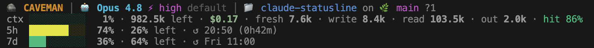

<div align="center">

# 🛰️ Claude Code Statusline

A multi-line status bar for <a href="https://code.claude.com/docs/en/statusline" target="_blank" rel="noopener">Claude Code</a>: context window, subscription usage limits, token/cache economics, and git state — rendered in the terminal from the data Claude Code feeds the statusline.

[](https://github.com/mvinnicius22/claude-statusline/actions/workflows/ci.yml)


</div>

## Preview



## Requirements

- **bash** 3.2+ (ships with macOS; standard on Linux/WSL)
- **jq** — required
- **git** — optional (the git segment hides if absent)
- **OS** — macOS, Linux, or Windows via WSL. Native Windows / PowerShell is not supported.

## Install

```bash
curl -fsSL https://raw.githubusercontent.com/mvinnicius22/claude-statusline/main/install.sh | bash
```

Or clone and run:

```bash
git clone https://github.com/mvinnicius22/claude-statusline.git
cd claude-statusline
./install.sh
```

The installer copies `statusline.sh` to `~/.claude/`, backs up `settings.json`, and injects the `statusLine` block. Open a new Claude Code tab or run `/statusline` to apply.

## How it works

- Subscription limits and cost come from the data Claude Code already pipes to the statusline (<a href="https://code.claude.com/docs/en/statusline" target="_blank" rel="noopener">statusline docs</a>) — no network calls, no API key, no extra tokens.
- Limit percentages reflect your real usage window. The reset time can be off by a minute or two if you also use Claude on another machine (that usage isn't in the local data).
- The token breakdown is parsed from the session transcript and cached by mtime.

## What's on screen

Five lines, each independently toggleable.

### Line 1 — Identity

```text
🪨 CAVEMAN │ 🤖 Opus 4.8 ⚡high · default │ 📁 myproject on 🌿 main  A2 M3 D1 ?4
```

| Element | Meaning |
|---|---|
| `🪨 CAVEMAN` | The [caveman](https://github.com/juliusbrussee/caveman) plugin's active mode, read from `~/.claude/.caveman-active`. Shows the level (`CAVEMAN:ULTRA`) when not `full`. Hidden when the plugin is off. |
| `🤖 Opus 4.8` | Active model display name (`model.display_name`). |
| `⚡high` | <a href="https://code.claude.com/docs/en/statusline" target="_blank" rel="noopener">Reasoning effort</a>, color-coded: `low` green · `medium` yellow · `high` magenta · `xhigh`/`max` red. |
| `default` | Current <a href="https://code.claude.com/docs/en/output-styles" target="_blank" rel="noopener">output style</a>. `default` is the built-in style; change it with `/output-style`. |
| `📁 myproject` | Working directory (basename). |
| `🌿 main` | Git branch, or short SHA when detached. |
| `↑2 ↓1` | Commits ahead / behind the upstream branch (only shown when an upstream is set and the branch has diverged). |

Changed files are summarized **one letter per type**, only shown when non-zero, colored by intent: `A` added (green), `M` modified (yellow), `D` deleted (red), `R` renamed (blue), `?` untracked (gray). So `A2 M3 D1 ?4` means 2 added, 3 modified, 1 deleted, 4 untracked. Untracked counts individual files, not directories.

When Claude Code's working directory moves away from where the session started, a dim `← origin` marker is appended (e.g. `📁 claude-statusline on 🌿 main ← cpp-platform`). It means the loaded session context — CLAUDE.md, git state, memory — came from a different project. Toggle it with `SL_DRIFT`.

### Line 2 — Context & cost

```text
ctx █░░░░░░░░░  14% · 853k left · $4.92
```

- **bar + `14%`** — share of the context window in use (`context_window.used_percentage`). Greens → yellows → reds as it fills (≥60% yellow, ≥80% red).
- **`853k left`** — exact free tokens, from `total_input_tokens` against `context_window_size`. Not a rounded percentage, so it matches `/context`.
- **`$4.92`** — `cost.total_cost_usd`. The <a href="https://code.claude.com/docs/en/statusline" target="_blank" rel="noopener">statusline docs</a> define it as the *"estimated session cost in USD, computed client-side"* that *"may differ from your actual bill"*. Claude Code multiplies the session's tokens by the model's list prices (input, output, and cache rates each differ) and accumulates from the first message. On a Pro/Max subscription you pay a flat fee, so this is a reference figure ("what it would cost on the pay-as-you-go API"), not a charge.

### Lines 3–4 — Subscription usage limits

```text
5h  █████████░  95% ·  5% left · ↺ 15:50 (1h52m) ↑
7d  ██░░░░░░░░  28% · 72% left · ↺ Fri 11:00
```

Read from `rate_limits` in the <a href="https://code.claude.com/docs/en/statusline" target="_blank" rel="noopener">statusline input</a> — no API call, no token cost. These lines appear only on **Pro/Max** plans, where Claude Code provides this data; on API/enterprise billing they're omitted.

- **bar + `% · % left`** — used and remaining share of the rolling 5-hour and 7-day windows, the same figures shown on the usage page.
- **`↺ 15:50 (1h52m)`** — reset time and live countdown.
- **Pace arrow** — projects window-end usage as `used% × (window ÷ elapsed)`: `→` on pace (projected 85–115%), `↑` too fast / will exhaust before reset (>115%, red), `↓` slack (<85%, green).

Anthropic only exposes a percentage for these windows, not a token quota, so these lines show `% left`, never an absolute token count.

### Line 5 — Session token breakdown

```text
tok fresh 6.5k · write 130k · read 834k · out 13.9k · hit 92%
```

Cumulative token counts for the session, parsed from the transcript (cached by file mtime, so a large session isn't re-read every refresh). Each type is billed at a different multiple of the base input price, per the <a href="https://platform.claude.com/docs/en/build-with-claude/prompt-caching" target="_blank" rel="noopener">prompt caching docs</a>:

| Token | What it is | Billed at |
|---|---|---|
| `fresh` | New input tokens | **1×** |
| `write` | Tokens written to the prompt cache | **1.25×** (5-min) / **2×** (1-hour) |
| `read` | Tokens read from cache (cache hits) | **0.1×** |
| `out` | Tokens the model generated | output rate |

`read` is usually the largest: every turn re-sends the whole conversation, and the stable prefix is re-read from cache at 0.1× instead of paid fresh.

`hit 92%` is the **cache hit rate** = `read ÷ (fresh + write + read)` — the share of input served from the cheap cache. Higher is cheaper; a steady session sits at 80–95%+. It drops when the context churns (files edited, tools changing, switching projects), which invalidates the cache and forces 1.25× re-writes. Color: green ≥70%, yellow ≥40%, red below.

## Additional configuration

Set environment variables inside the `command` field of `settings.json`:

```json
"statusLine": {
  "type": "command",
  "command": "SL_7D=0 SL_ICONS=nerd ~/.claude/statusline.sh"
}
```

### Toggles

| Variable | Default | Set to `0` to… |
|---|:---:|---|
| `SL_CAVEMAN` | 1 | hide the caveman mode badge |
| `SL_GIT` | 1 | hide the git segment |
| `SL_CTX` | 1 | hide the context/cost line |
| `SL_LIMITS` | 1 | hide both 5h and 7d lines |
| `SL_7D` | 1 | hide only the 7d line |
| `SL_TOKENS` | 1 | hide the token breakdown line |
| `SL_DRIFT` | 1 | hide the `← origin` drift marker |

### Icons

| `SL_ICONS=` | Result |
|---|---|
| `emoji` *(default)* | 🤖 📁 🌿 — works with any font |
| `nerd` | Nerd Font glyphs (`󰚩`, ``, ``) — needs a [Nerd Font](https://www.nerdfonts.com/) |
| `none` | no leading icons |

## Uninstall

```bash
./uninstall.sh
```

Removes the `statusLine` block from `settings.json` (backup first), deletes `statusline.sh`, and clears the token caches.

## License

MIT

## Author

Marcos Vinicius
